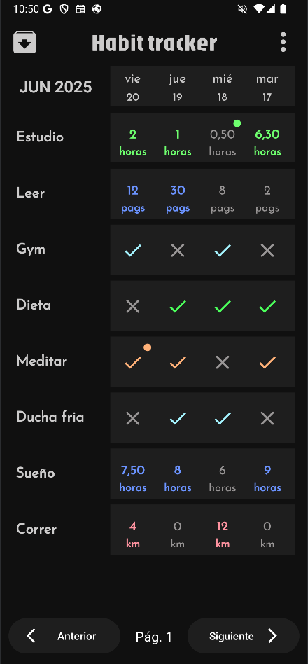
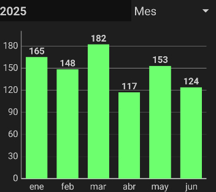
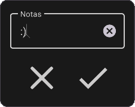
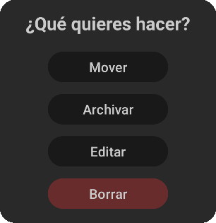

# 📱 Habit Tracker

Una app Android para ayudarte a construir buenos hábitos y alcanzar tus objetivos diarios, semanales, mensuales o anuales. Minimalista, sin anuncios, sin registros y totalmente **offline** para mayor **privacidad**.

  

---

## 🚀 Características

- ✅ Seguimiento de hábitos con interfaz simple
- 🔢 Soporte para hábitos numéricos y booleanos (Sí / No)
- 📊 Estadísticas detalladas y rachas
- 🗃️ Agrupación por etiquetas y categorías
- 📂 Exportación de datos a CSV y copias de seguridad
- 🌙 Modo oscuro y selector de tema
- 🌍 Multilenguaje (Español, Inglés, Portugués, Italiano, etc.)
- ❌ Sin anuncios, sin cuentas, 100% privacidad

---

## 🧪 Tecnologías

- **Kotlin**
- **Jetpack ViewModel**
- **Room DB** (persistencia local)
- **LiveData**
- **Material Design Components**

---

## 📸 Capturas de pantalla

  
  
  

---

## 📦 Instalación

Próximamente en PLay Store